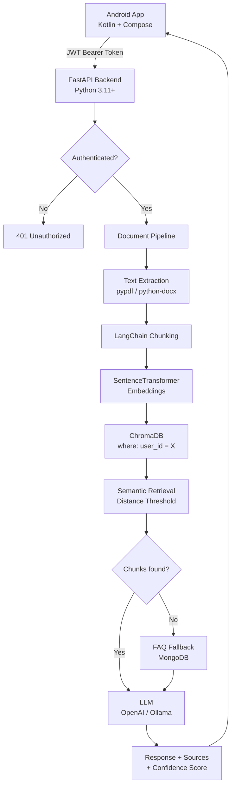

# AI Study Assistant — Full-Stack RAG Platform with Android App

A complete AI-powered study assistant: a **FastAPI + RAG** backend paired with a polished **Android app** (Kotlin + Jetpack Compose). Upload PDFs or DOCX files, index them with semantic embeddings, and get accurate, source-cited answers through a mobile interface.



## Features

- **JWT Authentication** — register, login, persistent sessions
- **User Isolation** — each user sees only their own documents, chat history, and vector chunks
- **RAG Pipeline** — PDF/DOCX upload → chunking → local embeddings → ChromaDB → LLM
- **Hallucination Prevention** — cosine distance threshold + FAQ fallback + strict system prompt
- **Multiple Chat Sessions** — create, continue, and delete conversations
- **Android App** — polished Material 3 UI with dark mode, proper loading/error states
- **LLM Flexibility** — switch between Google Gemini, OpenAI (cloud), and Ollama (local, free) via config

---

## Technology Stack

| Layer | Technologies |
|-------|-------------|
| **Backend** | Python 3.11+, FastAPI, Uvicorn, Pydantic v2 |
| **Auth** | JWT (PyJWT), bcrypt (passlib) |
| **Database** | MongoDB (Motor async driver) |
| **Vectors** | ChromaDB (persistent, local) |
| **Embeddings** | SentenceTransformers `all-MiniLM-L6-v2` |
| **LLM** | Google Gemini, OpenAI API, or Ollama (OpenAI-compatible) |
| **RAG** | LangChain text splitters + LangChain prompt templates |
| **Parsing** | pypdf (PDF), python-docx (DOCX) |
| **Android** | Kotlin, Jetpack Compose, Material 3 |
| **Networking** | Retrofit 2, OkHttp 4 |
| **Storage** | DataStore Preferences (JWT token) |

---

## Project Structure

```
AI-Study-Assistant/
├── backend/                  ← FastAPI application
│   ├── app/
│   │   ├── auth.py           ← JWT creation, password hashing, get_current_user dep
│   │   ├── config.py         ← Pydantic Settings (reads .env)
│   │   ├── database.py       ← MongoDB async client wrapper
│   │   ├── dependencies.py   ← FastAPI dependencies
│   │   ├── main.py           ← App factory, CORS, routers
│   │   ├── schemas.py        ← All Pydantic models
│   │   ├── routers/
│   │   │   ├── api.py        ← Protected endpoints (documents, chat, query, stats)
│   │   │   └── auth.py       ← /api/auth/register, login, me
│   │   └── services/
│   │       ├── document_service.py   ← PDF/DOCX text extraction
│   │       ├── rag_service.py        ← ChromaDB + embeddings + user_id filtering
│   │       └── llm_service.py        ← OpenAI/Ollama abstraction
│   ├── requirements.txt
│   └── .env.example
├── android/                  ← Android Studio project
│   └── app/src/main/java/com/studyassistant/app/
│       ├── data/api/         ← Retrofit interface
│       ├── data/model/       ← Kotlin data classes
│       ├── data/repository/  ← Repository classes
│       ├── ui/theme/         ← Material 3 theme
│       ├── ui/components/    ← Reusable composables
│       ├── ui/screens/       ← All screens
│       ├── viewmodel/        ← ViewModels
│       ├── navigation/       ← NavGraph + Screen sealed class
│       └── util/             ← SessionManager, NetworkModule
├── frontend/                 ← Original React frontend (unchanged)
└── docker-compose.yml
```

---

## Backend Setup

### Prerequisites
- Python 3.11+
- MongoDB (running locally or via Docker)
- An LLM: OpenAI API key OR local Ollama with a model pulled

### 1. Create the virtual environment

```powershell
cd "D:\Mobile App Dev Project\MAD AI-Study-Assistant"
py -3.11 -m venv .venv
.\.venv\Scripts\Activate.ps1
pip install -r backend\requirements.txt
```

### 2. Configure environment variables

```powershell
Copy-Item backend\.env.example backend\.env
```

Edit `backend/.env`:

```env
MONGO_URL=mongodb://localhost:27017
DB_NAME=study_assistant

# Option 1: Google Gemini (Recommended)
LLM_PROVIDER=gemini
LLM_MODEL=gemini-1.5-flash
GEMINI_API_KEY=your-gemini-api-key-here

# Option 2: Ollama (Free, Local)
# LLM_PROVIDER=ollama
# LLM_MODEL=llama3.2
# OLLAMA_BASE_URL=http://127.0.0.1:11434/v1

# Option 3: OpenAI
# LLM_PROVIDER=openai
# LLM_MODEL=gpt-4o-mini
# OPENAI_API_KEY=your-openai-api-key-here

# JWT — generate a strong secret:
# python -c "import secrets; print(secrets.token_hex(32))"
JWT_SECRET_KEY=your-long-random-secret-here
JWT_EXPIRE_MINUTES=10080
```

### 3. Start MongoDB

**Option A — Docker (simplest):**
```powershell
docker run -d -p 27017:27017 --name mongo mongo:7
```

**Option B — local MongoDB installation:** ensure `mongod` is running.

### 4. Run the backend

**For Android Emulator** (emulator uses 10.0.2.2 to reach host localhost):
```powershell
cd backend
uvicorn server:app --reload --host 127.0.0.1 --port 8000
```

**For Physical Android Phone** (phone must reach your machine's IP):
```powershell
cd backend
uvicorn server:app --reload --host 0.0.0.0 --port 8000
```

The interactive API docs are at: `http://127.0.0.1:8000/docs`

### 5. (Optional) Seed FAQ data
```powershell
curl -X POST http://127.0.0.1:8000/api/faqs/seed
```

---

## Android App Setup

### Prerequisites
- Android Studio Hedgehog (2023.1.1) or newer
- JDK 17+
- Android SDK (API 26+)

### 1. Open the project

In Android Studio: **File → Open** → select the `android/` folder (not the project root).

### 2. Create local.properties

Android Studio creates this automatically, but if missing:
```
sdk.dir=C:\Users\YOUR_USERNAME\AppData\Local\Android\Sdk
```

### 3. Gradle sync

Click **Sync Project with Gradle Files** (or let Android Studio do it on first open).

### 4. Configure the base URL

In `android/app/src/main/res/values/strings.xml`:

```xml
<!-- For Android Emulator (maps to your machine's localhost) -->
<string name="api_base_url">http://10.0.2.2:8000</string>

<!-- For Physical Device (replace with your machine's local IP) -->
<!-- <string name="api_base_url">http://192.168.1.xxx:8000</string> -->
```

> **Finding your machine's IP**: run `ipconfig` in PowerShell and look for your Wi-Fi adapter's IPv4 address. Both the phone and your PC must be on the same Wi-Fi network.

### 5. Run the app

- Select an emulator (API 26+) or connect a USB-debugging-enabled Android phone
- Click ▶ **Run 'app'** in Android Studio

---

## API Endpoints

### Authentication (public)

| Method | Path | Description |
|--------|------|-------------|
| POST | `/api/auth/register` | Create account → returns JWT |
| POST | `/api/auth/login` | Login → returns JWT |
| GET | `/api/auth/me` | Validate token + get current user |

### Protected (require `Authorization: Bearer <token>`)

| Method | Path | Description |
|--------|------|-------------|
| GET | `/api/documents` | List current user's documents |
| POST | `/api/upload-document` | Upload PDF/DOCX → index in ChromaDB |
| DELETE | `/api/documents/{doc_id}` | Delete document + its vectors |
| GET | `/api/chat-sessions` | List current user's chat sessions |
| POST | `/api/chat-sessions` | Create new chat session |
| DELETE | `/api/chat-sessions/{session_id}` | Delete session + all messages |
| GET | `/api/chat-history/{session_id}` | Get messages for a session |
| POST | `/api/query` | Ask a RAG question |
| GET | `/api/faqs` | List FAQs (global) |
| GET | `/api/stats` | User-specific document/chunk/FAQ counts |
| GET | `/health` | Service health check (public) |

---

## Authentication Flow

```
Android Launch
      │
      ▼
  SplashScreen
  (check DataStore for token)
      │
  ┌───┴───┐
  │       │
token   no token
exists    │
  │       ▼
  │    LoginScreen ──── SignupScreen
  │       │
  ▼       ▼
GET /api/auth/me  POST /api/auth/login
  │                     │
  ├── 200 OK ───────────┤
  │   save user info    │
  │   navigate Home     │
  │                     │
  └── 401 ──── clear token ──── LoginScreen
```

JWT tokens are stored in Android DataStore Preferences (private to the app). The OkHttp `AuthInterceptor` automatically attaches the token to all protected requests. On receiving a 401, the app clears the token and redirects to Login.

---

## RAG Security — User Isolation

```
User A uploads document.pdf
  └── Stored in ChromaDB with metadata: {user_id: "user-A-uuid", doc_id: "...", ...}

User B queries "What is photosynthesis?"
  └── retrieve() called with user_id="user-B-uuid"
  └── ChromaDB where={"user_id": "user-B-uuid"}
  └── Only User B's chunks are searched
  └── User A's document.pdf is NEVER retrieved
```

The `user_id` filter is enforced at the RAG service level — not just at the API layer. Even if a malicious client somehow bypassed the JWT check, the ChromaDB `where` filter would still prevent cross-user data access.

---

## Confidence Score Display

| Score | Label | Color |
|-------|-------|-------|
| ≥ 0.7 | High | Green |
| ≥ 0.4 | Medium | Orange |
| < 0.4 | Low | Red |
| null | FAQ / Unknown | Gray |

---

## Docker (Full Stack)

```powershell
# Ensure backend/.env has OPENAI_API_KEY or Ollama config
docker compose up --build
```

API at `http://localhost:8000`. For Android emulator, use `http://10.0.2.2:8000`. MongoDB and ChromaDB data are persisted in named volumes.

---

## Known Limitations

1. **No token refresh** — tokens expire after 7 days; the user is redirected to Login
2. **Single ChromaDB collection** — all users share one collection; isolation is via metadata filtering
3. **Scanned PDFs** — image-only PDFs with no text layer cannot be indexed (OCR not implemented)
4. **Local embeddings** — first document query downloads the `all-MiniLM-L6-v2` model (~85 MB)
5. **Ollama on emulator** — Ollama must run on the host; emulator access requires `OLLAMA_BASE_URL=http://10.0.2.2:11434/v1` in the backend `.env`
6. **No HTTPS** — the Android app uses cleartext HTTP for local development; use a reverse proxy (nginx + TLS) for production
7. **No multi-device sync** — the session UUID is stored in DataStore; different devices can log in to the same account but start with their own local session context

---

## Testing the Security Isolation

To verify User A cannot access User B's data:

1. Register User A, upload a document, ask a question
2. Register User B (different email), check that Documents screen is empty
3. Ask the same question as User B — you should get "information not in uploaded documents"
4. Try to delete User A's document ID via User B's token — expect 404

---

## Development Notes

- **Backend logs** show request processing, authentication events, and errors at INFO level
- **Android LogCat** tag: `OkHttp` shows all HTTP requests/responses in debug builds
- The backend's `/docs` endpoint (Swagger UI) lets you test all APIs directly in the browser
